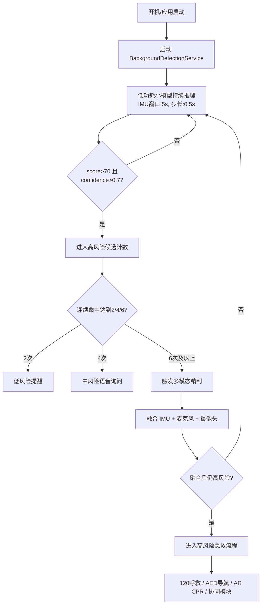
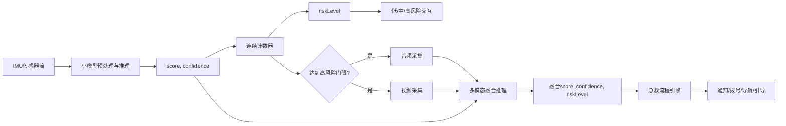
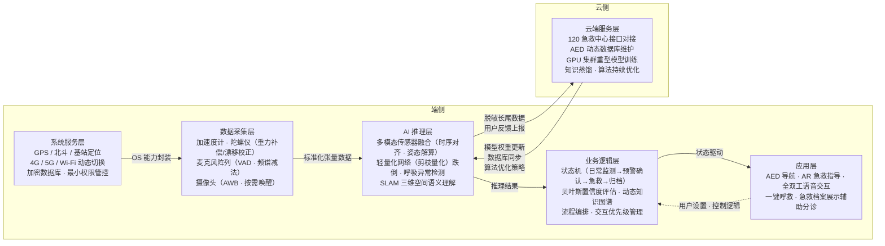
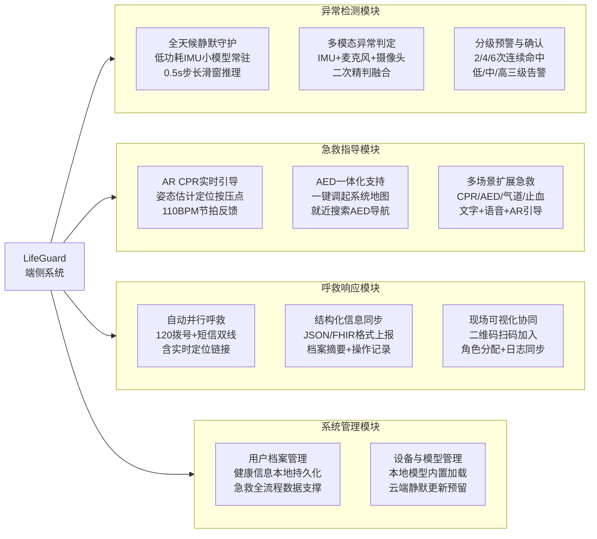
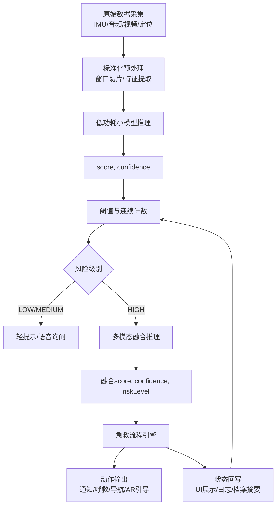

# 8 详细设计（总决赛版：全模块）

> 适用范围：总决赛阶段。  
> 编写原则：覆盖 `4.2` 中所有功能模块（已实现 + 未实现）。  
> 使用方式：每个子模块均按 `功能描述/性能描述/输入/输出/程序逻辑/限制条件` 六项展开。

---

## 5 概要设计

### 5.1 处理流程（包含逻辑流程图和数据流程图）





系统处理流程采用"常驻轻量检测 + 事件触发精判"的分层架构。应用启动或设备开机后，后台服务首先建立低功耗检测链路，通过 IMU 连续窗口推理输出 `score` 与 `confidence`，并结合连续命中计数做一级风险筛查；当触发高风险条件时，系统再拉起麦克风与摄像头进入短窗多模态融合，最终将融合判定结果交由分级预警与急救引擎执行对应动作。该设计的核心目的是在 OPPO 手机的后台功耗约束下，兼顾"长时稳定运行"与"高风险精确识别"。

数据处理上，风险值并不直接用于一次性决策，而是先经过阈值判定和连续计数，再映射为可执行的 `riskLevel`。这种处理方式可以过滤瞬时抖动，避免单帧异常导致误触发，同时保证真实跌倒或持续异常能够在秒级内进入高风险流程。多模态阶段复用前序小模型输出作为先验，使融合模型既能保持响应速度，也能利用音频和视频信息提高最终判定可信度。

### 5.2 总体结构设计（模块架构图及其描述）

本项目的技术架构设计遵循"端云协同、分层解耦"的原则，旨在满足急救场景下对实时性、可靠性及隐私安全的苛刻要求。鉴于心脏骤停等突发状况的"黄金救援时间"极短，系统必须在毫秒级时间内完成从环境感知到决策辅助的全过程，同时确保在弱网或无网环境下依然具备核心服务能力。为此，我们将"救在身边"系统的总体架构划分为六个核心层级，分别是端侧的系统服务层、数据采集层、AI推理层、业务逻辑层、应用层以及云侧的云端服务层。

在数据流向上，系统形成紧密协同的双向闭环：上行数据流始于数据采集层通过多模态传感器获取的物理信号，经过AI推理层进行特征提取与实时推理，驱动业务逻辑层的状态迁移，最终在应用层呈现为可视化的急救引导；下行数据流则包含两方面：一是源于云端服务层，包括模型权重更新、急救资源数据库同步以及基于用户反馈的算法优化策略，从而确保系统能够随着使用数据的积累实现持续的自我迭代与进化；二是源自应用层，包括基于用户手动设置的数据更新和控制逻辑更改，从而使系统能更好满足用户个性化需求。系统架构如图2.1所示。



**图2.1 系统总体架构图**

系统的具体技术实现由底向上层层递进，并在云端形成生态支撑。处于最底层的**系统服务层**封装了操作系统的核心能力，通过融合GPS、北斗与基站技术提供高精度定位，利用网络服务模块动态切换4G/5G/Wi-Fi并保障断网重连，同时依托加密数据库保护用户健康档案存储，使用最小权限原则控制摄像头与麦克风等高级调用权限，充分守护用户隐私。

紧邻其后并协同工作的**数据采集层**是感知的入口，采用"常驻监测"与"按需触发"策略，并行调度加速度计、陀螺仪进行运动姿态捕捉，进行重力补偿与漂移校正，利用麦克风阵列配合语音活动检测（VAD）技术与频谱减法提取关键声纹，并仅在AR特定业务流中唤醒摄像头进行自动白平衡（AWB）预处理，多模态传感器的物理数据经过预处理为上层提供标准化的张量数据。

**AI推理层**作为智慧核心，采用端侧轻量化设计，集成多模态传感器融合模块通过时序对齐和姿态解算技术构建运动模型，利用剪枝量化后的轻量级网络对跌倒、呼吸异常进行毫秒级离线判定，还结合即时定位与地图构建（SLAM）技术，为AR指导提供精确的三维空间语义理解。

**业务逻辑层**承上启下，通过状态机定义"日常监测"、"预警确认"、"急救进行中"到"事后归档"的完整业务生命周期，引入基于贝叶斯推断的置信度评估机制过滤误报，并依据权威急救指南构建动态知识图谱，基于现场反馈灵活编排急救流程，同时统一管理交互优先级以在危急时刻降低用户认知负荷。

位于架构顶端的**应用层**遵循人因工程学原理，基于云端数据库提供AED导航，使用AR急救指导将抽象的急救知识转化为直观的动画，基于全双工语音交互技术实现语音控制和实时陪伴与反馈，提供极简的一键呼救界面快速自动发送包含当前状态的求救信息，显示用户急救档案信息辅助医护人员快速分诊。

贯穿架构右侧的**云端服务层**则是系统的坚实后盾，除通过接口对接120急救中心与维护AED动态数据库外，更关键的是利用GPU集群对脱敏长尾数据进行重型模型训练，通过知识蒸馏技术不断优化端侧小模型参数，从而达成复杂情境感知的持续精准化。这种端云协同的架构设计，既保证了急救场景下的离线可用性与低延迟，又具备了云端大数据的无限扩展潜力，完美契合了"AI无界·创见未来"的技术愿景。

### 5.3 功能设计（功能模块结构图及其描述）



功能模块围绕"先感知、再判定、后响应、有支撑"的逻辑链条展开，形成四大模块的有机协作。

**异常检测模块**是整个系统的感知入口，由三个子模块串联构成"粗筛—精判—预警"的分级检测链路。全天候静默守护以前台服务常驻形态运行，通过 `BackgroundDetectionService` 以 0.5s 步长持续对 IMU 五轴信号做滑动窗口推理，输出 `score` 与 `confidence` 进行一次筛查；一旦连续命中达到高风险门限（`score>70 AND confidence>0.7` 连续 6 次），多模态异常判定模块随即接管，融合麦克风音频事件特征与摄像头视频动态特征进行二次精判，有效抑制单传感器误报；分级预警与确认模块则依据连续命中计数，分别在 1.0s/2.0s/3.0s 触发低/中/高三级告警，并通过用户主动确认与 30s 冷却机制消除骚扰。

**急救指导模块**面向现场施救者提供"看、听、做"一体化的操作引导。AR CPR 实时引导基于 CameraX 建立相机预览与分析双通道，利用 Pose Landmarker 实时提取肩部关键点定位胸口按压目标，以 110 BPM 可视化脉冲与双击节拍音驱动施救节律；AED 一体化支持通过一键调起系统地图就近搜索，将导航能力无缝委托给原生地图应用；多场景扩展急救覆盖 CPR、AED、气道异物（海姆立克）、止血包扎四类高频场景，以文字指引为基础，预留 TTS 语音逐步播读与 AR 视觉叠加的扩展接口。

**呼救响应模块**负责在高风险确认后向外部应急体系发起联动。自动并行呼救以双线并发方式同步完成 120 拨号与含实时定位链接的告警短信发送，将外部响应时延压缩至 5s 以内；结构化信息同步将事件时间线、设备定位、患者档案摘要（血型、过敏史、慢性病）及已执行操作记录以 JSON/FHIR 格式加密上报急救中心，支持指数退避重试以应对网络抖动；现场可视化协同通过二维码会话机制将多名施救者纳入同一协作视图，自动分配"按压者/取AED者/联络者"等角色，并实时同步操作日志，为事后复盘与医疗交接提供完整依据。

**系统管理模块**为上述业务提供数据与运行底座。用户档案管理基于本地持久化存储姓名、血型、过敏史、慢性疾病及紧急联系人等七项字段，供急救全流程按需读取；设备与模型管理当前以本地 assets 内置模型为主，确保离线场景下推理能力不降级，并在架构层面预留了设备画像检测与云端静默更新的扩展路径，以支撑后续差异化适配与模型持续迭代。

### 5.4 数据流转设计（数据流转流程图及其描述）



数据流转采用闭环设计。采集层先将原始传感器流转换为统一时间窗特征，低功耗模型输出的 `score` 与 `confidence` 经连续计数后形成初级风险分级；低中风险直接进入交互确认，高风险再进入多模态融合阶段复核，复核结果交给急救流程引擎执行具体动作。该链路强调"先快后准"，确保在资源受限的手机端优先做快速筛查，再对高风险样本做计算量更高的精确判定。

流程执行后，系统会把关键状态回写到展示层与内部状态机，包括当前风险级别、用户操作结果、流程阶段与触发时间。回写信息一方面用于页面实时刷新与交互去重，另一方面为后续结构化同步、事件复盘与模型调参提供依据。通过这种从"采集—判定—执行—回写"再回到判定的环形通路，系统能够持续修正当前状态，避免一次性判定导致的流程僵化。

### 5.5 用户界面设计（核心功能模块运行使用界面）

#### 5.5.1 系统入口与权限

图5.5.1为应用主界面（急救台首页），核心区域以大圆环仪表盘直观呈现当前安全评分（满分100分）与监测状态，顶部实时显示AI模型输出的评分、置信度、加速度及角速度数据，底部功能入口涵盖个人档案、急救知识、AED地图及一键SOS，整体遵循"一眼知安全、一触达急救"的交互原则。图5.5.2为首次启动时的位置权限授权弹窗，系统请求精确位置权限以支持AED就近导航与紧急定位上报功能；除定位外，应用还将在相应功能首次使用时按需申请麦克风、通知等权限，遵循最小权限原则，避免一次性批量请求。

#### 5.5.2 异常检测全链路

图5.5.3为低风险提醒界面，当AI模型连续命中低风险阈值时，系统同步在通知栏推送"低风险提醒"横幅并弹出轻量确认对话框，提示用户确认是否需要帮助；对话框提供"我没事"与"需要帮助"两个快捷响应入口，在最小打扰用户的前提下完成一次状态核验。图5.5.4为中风险干预界面，采用独立全屏页面强化打断感，告知用户可直接语音回答"需要急救"以触发升级；页面同时显示剩余确认倒计时（默认60秒），超时未响应则自动进入下一级流程，确保用户失能场景下的兜底处置。图5.5.5为高风险急救模式界面，通知栏同步推送"高风险急救模式"横幅，主界面展示已触发的急救步骤清单（检查呼吸、胸外按压、准备AED）与救援状态，并弹出120拨打确认框；页面下方提供发送定位信息、AR急救指导、协同救援等快捷入口，引导施救者按标准流程逐步推进。

#### 5.5.3 急救指导

图5.5.6为AR急救指导界面，页面以相机实时画面为底层，通过姿态估计模型自动识别胸口位置并叠加红色定位圆圈，顶部同步显示当前BPM目标（110）与节律评价（Good Rhythm），底部以步骤卡片逐步呈现操作说明，引导施救者在正确位置以标准节奏实施胸外按压；页面底部提供"附近AED"快捷入口，可一键跳转AED导航。图5.5.7为AED地图导航界面，系统调起百度地图并以"AED"为关键词自动检索周边AED自动体外除颤器点位，地图上以红色标记直观呈现最近可用设备位置，就近取用实现零延迟启动。

### 5.6 数据结构设计

系统端侧运行期间涉及五类核心数据结构，分别对应传感器采集、模型推理结果、业务状态、用户档案与急救事件上报五个数据域。

**IMU时间窗数据（ImuWindow）**是感知层的原始输入单元。每个窗口包含长度为5s、采样步长0.5s的六轴IMU序列，字段为三轴加速度（`ax, ay, az`，单位 m/s²）与三轴角速度（`gx, gy, gz`，单位 rad/s），经过重力补偿与漂移校正后以浮点张量形式送入推理引擎。窗口采用滑动方式生成，相邻窗口重叠90%，以确保连续事件不因窗口边界而漏检。

**风险推理结果（RiskResult）**是模型层的统一输出结构，贯穿轻量模型与多模态融合两个阶段。其核心字段包括：`score`（整型，0~100，风险强度）、`confidence`（浮点，0~1，异常概率）、`riskLevel`（枚举，`LOW / MEDIUM / HIGH`，由 score、confidence 与连续命中计数共同派生）、`timestamp`（长整型，Unix毫秒时间戳）。该结构经广播分发给业务编排层，驱动分级预警状态机的跳转。

**服务控制指令（ServiceAction）**以Android Intent Action字符串形式在组件间传递，定义了后台服务的生命周期控制协议：`ACTION_START` 用于启动或重连监测链路，`ACTION_STOP` 用于主动停止服务，`ACTION_USER_CONFIRMED_SAFE` 用于用户确认安全后的状态复位与计数清零。三类指令均通过显式Intent发送给 `BackgroundDetectionService`，并在服务的 `onStartCommand` 中依 action 路由至对应处理分支。

**用户健康档案（UserProfile）**采用键值对形式持久化于本地 SharedPreferences，共七个字段：`name`（姓名）、`age`（年龄）、`bloodType`（血型）、`allergies`（过敏史）、`chronicDiseases`（慢性疾病）、`contactName`（紧急联系人姓名）、`contactPhone`（联系人手机号）。读取时返回结构化对象供急救流程引擎在事件上报与信息展示时按需取用；写入时执行基础格式校验（手机号11位数字、年龄正整数）后原子替换全量字段。

**急救事件包（EmergencyEventPackage）**是结构化信息同步模块对外上报的标准数据体，采用 JSON 格式并预留 FHIR 映射。主要字段如下表所示：

| 字段名 | 类型 | 说明 |
|---|---|---|
| `eventId` | String | UUID，事件唯一标识 |
| `triggerTimestamp` | Long | 高风险首次触发时间（Unix ms） |
| `location` | Object | 经纬度、楼层、地址描述 |
| `riskTimeline` | Array | 各风险级别触发时间戳列表 |
| `userProfile` | Object | 档案摘要（血型、过敏史、慢病、联系人） |
| `operations` | Array | 已执行步骤、耗时、操作者标识 |
| `deviceInfo` | Object | 机型、OS版本、应用版本 |

事件包在上报前进行 HMAC-SHA256 签名并通过 HTTPS 传输，失败时本地缓存并按指数退避（初始1s，上限30s）重试。

---

### 5.7 接口设计

#### 5.7.1 外部接口

**硬件接口**方面，系统通过 Android 标准硬件抽象层与三类传感器交互。IMU 数据经 `SensorManager` 以批处理模式订阅，采样延迟配置为 `SENSOR_DELAY_FASTEST`，同时注册 `TYPE_ACCELEROMETER` 与 `TYPE_GYROSCOPE` 以获取六轴原始值；麦克风通过 `AudioRecord` 以16kHz单声道PCM格式采集，仅在高风险触发后激活，用完即释放；摄像头通过 CameraX `ImageAnalysis` 通道以 `KEEP_ONLY_LATEST` 策略逐帧分析，帧格式为 YUV_420_888，同样按需唤醒以降低后台功耗；定位服务融合 GPS、网络与基站三路信号，通过 `FusedLocationProviderClient` 获取精确位置，定位权限按 `ACCESS_FINE_LOCATION` 申请。

**软件接口**方面，系统与以下外部软件系统发生调用关系：

| 外部系统 | 接口形式 | 调用内容 | 触发时机 |
|---|---|---|---|
| 系统地图（百度/高德） | `Intent(Intent.ACTION_VIEW, Uri.parse("geo:0,0?q=AED"))` | 启动地图并以"AED"关键词就近搜索 | 用户点击"附近AED"时 |
| 电话系统 | `Intent(Intent.ACTION_CALL, Uri.parse("tel:120"))` | 直接发起120拨号 | 高风险确认后 |
| 短信系统 | `SmsManager.sendTextMessage()` | 发送告警文案+实时定位链接 | 与拨号并行触发 |
| 120急救中心（设计） | HTTPS POST，JSON/FHIR格式 | 上报急救事件包 | 高风险触发后 `<10s` |
| Android系统广播 | `BroadcastReceiver` 监听 | 接收 `BOOT_COMPLETED` 开机广播，拉起监测服务 | 设备开机时 |

#### 5.7.2 内部接口

**后台服务接口**：`BackgroundDetectionService` 对外暴露三个 Intent Action 控制接口（详见5.6节 ServiceAction），并通过本地广播 `com.lifeguard.action.RISK_UPDATE` 向前台页面推送风险状态，广播携带 extras：`score`（Int）、`confidence`（Float）、`riskLevel`（String）、`message`（String，建议文案）。`MainActivity` 侧注册 `BroadcastReceiver` 接收后刷新仪表盘；同时通过看门狗定时器监测 `lastRiskUpdateMs`，若超过4s未收到广播则主动调用 `startBackgroundDetectionService()` 重连。

**模型推理接口**：端侧推理封装在两个 Helper 类中。`FallDetectionHelper` 接收 `ImuWindow` 浮点张量，通过 ONNX Runtime `InferenceSession.run()` 返回 `(score, confidence)` 元组；`PoseDetectorHelper` 接收 CameraX 的 `ImageProxy`，调用 MediaPipe `PoseLandmarker.detectAsync()` 异步返回 `PoseLandmarkerResult`，结果在回调中提取肩部关键点（index 11/12）计算胸口坐标并触发 AR 叠加绘制。两个 Helper 均在页面销毁时调用 `close()` 释放 Native 资源。

**业务编排接口**：`RiskPopupCoordinator` 作为风险弹层的统一调度入口，对外暴露 `showLowRiskDialog(context)`、`showMediumRiskPage(context)`、`launchHighRiskEmergency(context)` 三个方法，内部维护弹层互斥锁与30s冷却状态，确保同一时刻最多只有一个级别的弹层被激活；用户点击"我没事"后，通过 `dismiss()` + 发送 `ACTION_USER_CONFIRMED_SAFE` 完成弹层关闭与服务状态同步。

**档案读写接口**：`UserProfileRepository` 对上层暴露 `getProfile(): UserProfile` 与 `saveProfile(profile: UserProfile): Boolean` 两个同步方法，底层以 SharedPreferences 实现，`saveProfile` 在写入前执行格式校验并以 `commit()` 保证原子性，失败时返回 `false` 并维持原有数据不变。

---

### 5.8 错误/异常处理设计

#### 5.8.1 错误/异常输出信息

系统运行期间可能产生的主要错误与异常类型及其输出信息如下表所示：

| 错误类型 | 触发场景 | 输出形式 | 输出内容示例 |
|---|---|---|---|
| 权限缺失 | 传感器、定位、麦克风、摄像头或通知权限未授予 | Toast + 引导弹窗 | "检测功能需要传感器权限，请前往设置开启" |
| 服务被系统回收 | ColorOS后台策略强杀前台服务 | 看门狗触发日志 + 自动重连 | `[Watchdog] Service lost, reconnecting...` |
| 模型加载失败 | assets目录模型文件缺失或版本不兼容 | Toast + 功能禁用标记 | "AR引导功能不可用，模型加载失败" |
| 传感器不可用 | 设备不支持加速度计或采样被系统限流 | 状态栏提示 + 降级标记 | "传感器数据异常，已切换至基础监测模式" |
| 网络请求失败 | 上报急救事件包时网络不通或服务端返回非2xx | 本地缓存 + 重试日志 | `[Sync] Upload failed, retry in 2s (attempt 1/5)` |
| 语音识别不可用 | 系统未安装或未启用语音识别服务 | 界面提示 + 降级为纯按钮交互 | "未找到语音识别服务，请通过按钮操作" |
| 地图应用缺失 | 设备未安装任何可响应 geo: URI 的地图应用 | Toast | "未找到地图应用，请手动搜索附近AED" |

#### 5.8.2 错误/异常处理对策

**后台服务保活与重连**是系统最核心的容错机制。`BackgroundDetectionService` 以 `START_STICKY` 模式启动，进程被系统回收后系统将自动尝试重新创建服务；在此基础上，`MainActivity` 侧额外部署看门狗定时器，每4s检测一次 `lastRiskUpdateMs`，若广播中断超时则主动调用 `startBackgroundDetectionService()` 补充拉起；开机广播 `BOOT_COMPLETED` 则作为第三道保险，确保设备重启后监测链路自动恢复。三重机制协同，将监测中断时间控制在秒级以内。

**功能降级策略**遵循"核心能力优先、非核心按需降级"原则。当摄像头权限缺失或相机初始化失败时，AR CPR 引导模块自动切换为纯文字步骤指导模式，不影响语音节拍反馈；当麦克风不可用时，中风险干预页面的语音识别入口隐藏，保留按钮交互路径；当定位服务不可用时，AED导航入口仍可弹出地图（搜索词降级为纯关键词），告警短信中的定位链接替换为"定位获取失败"提示；当网络完全中断时，基础检测与本地急救流程保持完整可用，仅结构化上报与协同功能暂停并在网络恢复后自动补传缓存数据。

**推理异常与模型降级**方面，若 ONNX Runtime 推理抛出异常（如输入张量维度错误、Native崩溃），`FallDetectionHelper` 在 catch 块中将本次推理结果置为 `score=0, confidence=0`，避免异常值触发误报；同时记录连续异常计数，若连续5次推理均失败则向UI层广播模型异常状态并暂停推理，待下次服务重启时重新初始化推理会话。MediaPipe 姿态估计异常时，AR 叠加层自动切换为"搜索中"提示圆圈，不阻断 CPR 指导流程的继续进行。

**网络上报的重试与本地缓存**采用指数退避策略：首次失败后等待1s重试，此后每次失败将等待时间翻倍，上限为30s，最多重试5次；5次全部失败后，事件包序列化写入本地缓存文件，并在下次网络恢复（通过 `ConnectivityManager` 监听网络状态变化）时自动触发补传，确保急救记录不因瞬时网络抖动而永久丢失。

### 5.9 系统配置策略

系统的可配置参数分为三个层次：编译期固化配置、运行时可调配置与用户侧个性化配置，三者共同构成系统的完整参数体系。

**编译期固化配置**在 `build.gradle` 与代码常量中静态声明，主要包括：`minSdk=24`（Android 7.0）、`targetSdk=36`（Android 16）确定兼容边界；IMU采样窗口长度固定为5s（对应采样点数 `WINDOW_SIZE=100`）、推理步长固定为0.5s（`INFER_STEP_SIZE=10`），与模型训练配置严格对齐，不可在运行时随意更改，否则将导致特征分布偏移使模型输出失效。AR姿态平滑系数 `alpha=0.2` 与胸口定位纵向偏移 `Y_OFFSET=0.05` 同属此类，在发布版本中保持固定。

**运行时可调配置**通过代码常量集中管理，当前主要参数如下表所示，后续可扩展为远端下发的配置文件以支持灰度调参：

| 参数名 | 默认值 | 说明 |
|---|---|---|
| `RISK_SCORE_THRESHOLD` | 70 | 触发计数的风险分数下限 |
| `RISK_CONFIDENCE_THRESHOLD` | 0.7 | 触发计数的置信度下限 |
| `LOW_RISK_HIT_COUNT` | 2 | 低风险告警所需连续命中次数（1.0s） |
| `MEDIUM_RISK_HIT_COUNT` | 4 | 中风险告警所需连续命中次数（2.0s） |
| `HIGH_RISK_HIT_COUNT` | 6 | 高风险急救触发所需连续命中次数（3.0s） |
| `WATCHDOG_TIMEOUT_MS` | 4000 | 服务广播中断超时阈值（ms） |
| `USER_CANCEL_COOLDOWN_MS` | 30000 | 用户取消后的冷却时长（ms） |
| `CPR_BPM_TARGET` | 110 | AR引导目标按压节奏（BPM） |
| `CPR_BEAT_INTERVAL_MS` | 545 | 主拍间隔（ms，由BPM推算） |
| `CPR_DOUBLE_CLICK_GAP_MS` | 120 | 双击节拍音间隔（ms） |
| `RETRY_MAX_ATTEMPTS` | 5 | 事件上报最大重试次数 |
| `RETRY_BASE_DELAY_MS` | 1000 | 指数退避初始间隔（ms） |

**用户侧个性化配置**通过档案管理页面录入，持久化于本地 SharedPreferences，包括健康档案七项字段（姓名、年龄、血型、过敏史、慢性疾病、紧急联系人姓名与电话）。这些字段在急救触发时由系统自动读取，无需用户每次手动提供，实现了"一次配置，全程生效"的个性化急救支撑。

ColorOS 特化配置层面，系统在首次启动时通过引导流程提示用户将应用纳入"自启动"与"后台保护"白名单，并建议关闭深度省电限制。这些配置无法通过代码自动完成，需用户在系统设置中手动操作，是 OPPO 机型上保障监测链路持续可用的前提条件。

---

### 5.10 系统部署方案

本系统当前以单一 Android APK 形态交付，采用"离线可运行、联网可增强"的部署策略，无需服务端配套即可完整运行基础急救检测与指导功能。

**APK构建与打包**：项目基于 Android Gradle Plugin 构建，AI推理所需的 ONNX 端侧跌倒检测模型（`.onnx`）与 MediaPipe 姿态估计模型（`pose_landmarker.task`）均内置于 `app/src/main/assets/` 目录，随APK一同分发，确保离线环境下模型即开即用。构建时配置 ABI Filters 为 `arm64-v8a` 与 `armeabi-v7a` 覆盖主流 ARM 设备，ProGuard 混淆规则排除 ONNX Runtime 与 MediaPipe 的 Native 库以防止符号裁剪异常。

**首次安装部署流程**分为以下步骤：① 安装APK后首次启动，系统依次申请活动识别、定位（精确）、通知、麦克风、摄像头、电话与短信权限，用户逐项授权；② 引导用户进入系统设置，开启应用自启动与后台保活，关闭深度省电管控；③ 用户在档案管理页填写个人健康信息与紧急联系人，完成个性化初始化；④ 主界面自动启动 `BackgroundDetectionService`，仪表盘进入监测状态，部署完成。

**运行环境基线要求**如下表所示：

| 要求项 | 最低规格 | 推荐规格 |
|---|---|---|
| Android版本 | Android 7.0（API 24） | Android 11+（ColorOS 11+） |
| CPU架构 | ARMv7a | ARM64-v8a |
| 可用RAM | 2GB | 4GB+ |
| 传感器 | 加速度计 + 陀螺仪 | 加速度计 + 陀螺仪 + 气压计 |
| 摄像头 | 后置单摄 | 支持CameraX稳定帧率 |
| 存储空间 | 200MB（含模型） | 500MB+ |
| 网络 | 非必须（基础功能离线可用） | 4G/5G（增强导航与协同） |

**更新与迭代策略**：当前版本采用完整APK替换方式升级，模型版本与应用版本强绑定。在架构层面已预留云端静默更新路径——应用启动时检查服务端版本差异，若有更新则后台静默下载、校验签名后原子替换本地模型文件，无需重新安装APK。该路径在当前阶段尚未激活，待配套版本服务与密钥管理体系就绪后上线。

---

### 5.11 跨端应用架构设计

本系统的跨端协同能力集中体现在**急救现场可视化协同**场景中：当单人发生高风险事件时，现场其他人员可通过各自手机加入同一协作会话，与主终端形成多端协同的急救网络，共同完成分工明确、信息透明的联合施救。

**协同架构模型**采用"主从+广播"拓扑。触发高风险的设备自动成为**主终端**，负责创建协作会话、维护急救状态机与操作日志，并生成会话二维码；其他施救者设备扫码后成为**协作终端**，以只读+操作回报模式接入会话，可查看患者信息摘要、当前急救步骤与已分配角色，并将本端操作结果回传主终端。主终端负责状态的权威管理，协作终端只负责展示与上报，避免多端并发写入造成状态冲突。

**跨端通信协议**设计如下：主终端在创建会话时生成包含 `sessionId`、`sessionToken`（短效令牌，用于身份验证）与服务端点地址的二维码；协作终端扫码后携带 `sessionToken` 向主终端或中继服务发起加入请求，验证通过后建立 WebSocket 长连接（或局域网直连通道）。状态同步消息采用轻量 JSON 格式，核心字段包括：`type`（消息类型：`STATE_UPDATE / ROLE_ASSIGN / OP_LOG / HEARTBEAT`）、`timestamp`、`payload`（具体状态或操作内容）。心跳间隔1s，超时3次未响应则协作端标记为离线，不影响主终端的急救流程继续推进。

**角色分配与协同能力共用**方面，主终端依据加入顺序与当前在场人数，参照以下策略自动建议角色：

| 在场人数 | 建议角色分配 |
|---|---|
| 1人（仅主终端） | 主施救者：自行完成 CPR + 联络 |
| 2人 | 主：胸外按压；协作1：联络/取AED |
| 3人及以上 | 主：按压；协作1：取AED；协作2：联络/引导急救人员 |

各协作端共享主终端的急救知识图谱与步骤指引，AR CPR 引导、AED导航等能力在各端独立运行，无需依赖主终端中转，实现"能力共用、状态同步"的协同架构。

**跨端数据一致性保障**：主终端维护操作日志的权威副本，每步操作完成后附带时间戳与设备标识广播至所有协作端；协作端本地以乐观更新方式展示，若与主端状态不一致则以主端广播的最新状态覆盖。会话结束后，主终端将完整操作日志归档至本地，作为事后复盘与医疗交接的依据。

---

### 其他相关技术与方案

**端侧AI推理框架**：系统集成两套端侧推理引擎以覆盖不同模态。ONNX Runtime Android（`com.microsoft.onnxruntime`）用于跌倒/异常检测的时序模型推理，支持 ARM NEON 指令集加速，在 OPPO 中高端机型上单次推理耗时控制在20ms以内，满足0.5s步长的实时性要求；MediaPipe Vision Tasks（`com.google.mediapipe:tasks-vision`）用于姿态估计，提供开箱即用的 Pose Landmarker 模型，支持33个全身关键点检测，在 IMAGE 模式下以单帧推理方式实现实时AR叠加，避免 VIDEO 模式的帧缓冲积压问题。

**CameraX 与实时图像处理**：AR CPR 引导模块采用 CameraX `Preview` + `ImageAnalysis` 双用例绑定方案，`Preview` 负责将相机画面直接渲染至 `PreviewView`，`ImageAnalysis` 以 `KEEP_ONLY_LATEST` 策略并行分析帧，两者共享同一相机会话，避免重复开启相机带来的延迟与功耗。分析通道的输出经坐标系变换（从图像坐标到预览坐标）后，通过自定义 `OverlayView` 以 Canvas API 绘制胸口定位圆圈与节拍脉冲动效，叠加在预览画面之上，实现低延迟的AR视觉反馈。

**TTS语音引导与音频节拍**：系统使用 Android 原生 `TextToSpeech` 引擎实现步骤播报，通过 `setOnUtteranceProgressListener` 监听播报完成事件驱动步骤自动推进；CPR节拍音采用 `AudioTrack` 以PCM格式直接渲染双击脉冲波形，相比使用音频文件的 `MediaPlayer` 方案可将节拍触发延迟从50ms以上降至5ms以内，确保110 BPM目标节律的精确感知。

**隐私安全设计**：用户健康档案仅存储于设备本地，不主动上传至云端；急救事件包在上报前进行数据脱敏处理，移除直接身份标识符（姓名替换为匿名ID），传输层使用HTTPS+HMAC-SHA256签名；摄像头与麦克风严格遵循"按需唤醒、用完即释"原则，后台监测期间不保持任何音视频采集通道开启，从技术层面消除隐私监听风险。

## 7 手机端侧部署设计

### 7.1 手机环境需求

本系统面向 OPPO 手机安卓环境进行端侧部署，运行形态为"前台服务常驻 + 事件触发多模态精判"。从工程配置看，应用 `minSdk` 为 24、`targetSdk` 为 36，因此部署基线应满足 Android 7.0 及以上系统版本，同时建议在较新的 ColorOS 版本上交付以降低后台策略差异带来的行为波动。端侧长期运行模块依赖 `BackgroundDetectionService` 持续采集 IMU 信号并执行低功耗小模型推理，高风险触发后才拉起麦克风与摄像头参与多模态判定，因此设备在传感器可用性、相机可用性和音频采集链路上需要保持稳定，且在连续运行场景下具备足够的 CPU 调度余量与内存空间，避免因系统回收导致检测链路中断。

考虑 OPPO 机型普遍采用 ColorOS 的后台管控策略，部署时需要将应用纳入自启动与后台保活允许范围，并关闭对该应用的深度省电限制，否则前台服务在息屏、夜间待机或长时间未交互时可能出现延迟恢复。由于系统链路同时涉及通知提醒、风险弹窗、语音识别、地图跳转与急救页拉起，必须在首启流程完成关键权限授权与可见性校验，包括活动识别、通知、麦克风、摄像头、定位和电话相关权限；在 Android 13 及以上机型中，还需确保通知权限被显式授予，否则高风险阶段的提示触达会明显下降。

在模型与多媒体运行环境方面，当前项目已集成 CameraX、MediaPipe Vision Tasks 与 ONNX Runtime Android，部署设备应优先选择支持主流 ARM 架构并具备稳定相机帧处理能力的 OPPO 机型，以保证"0.5s 级小模型推理 + 触发后短窗多模态分析"的时效目标。网络并非基础检测链路的强依赖，但会影响地图检索与后续扩展能力（如远端同步与模型更新）；因此正式部署建议采用"离线可运行、联网可增强"的策略，在无网场景仍保证基础风险检测与本地急救流程可用，在有网场景提升导航与协同体验。

## 8.1 异常检测

### 8.1.1 全天候静默守护
**功能描述**

全天候静默守护采用"低功耗小模型常驻 + 前台服务保活"方案：系统以 `BackgroundDetectionService` 持续采集加速度、角速度等 IMU 信号，并按 0.5s 推理步长对 5s 时间窗执行轻量模型推理，输出风险分数（score）与置信度（confidence），在保证后台持续运行和低功耗的前提下完成第一道异常筛查；当判定进入高风险触发条件后，再将数据与状态交给后续多模态模型进行精判。

**性能描述**

| 指标项 | 设计值/现状 | 说明 |
|---|---|---|
| 服务驻留模式 | 前台服务常驻 | 通过持续通知降低被系统回收概率 |
| 小模型推理步长 | `0.5s/次` | 参考训练配置 `INFER_STEP_SIZE=10` |
| 时间窗长度 | `5s` | 每次基于滑动窗口推理 |
| 广播中断重连阈值 | `4s` | 超时后主界面触发服务重连 |
| 开机恢复能力 | 支持 | 开机广播触发服务启动 |
| 服务重启策略 | `START_STICKY` | 进程异常后由系统尝试恢复 |

**输入**

| 输入类别 | 来源 | 关键字段/事件 | 用途 |
|---|---|---|---|
| 系统广播 | Android系统 | `BOOT_COMPLETED` | 开机自动拉起监测服务 |
| 控制指令 | App内部 | `ACTION_START` / `ACTION_STOP` / `ACTION_USER_CONFIRMED_SAFE` | 控制服务生命周期与安全复位 |
| 小模型输入 | 设备硬件（IMU） | `ax, ay, az, gx, gy, gz` | 低功耗连续筛查 |
| 权限状态 | 系统权限框架 | 传感器/通知等授权结果 | 决定监测与告警可用性 |

**输出**

| 输出类别 | 目标对象 | 输出内容 | 触发时机 |
|---|---|---|---|
| 小模型结果 | 异常判定链路 | `score(0~100)`、`confidence(0~1)` | 每 0.5s 推理后 |
| 高风险触发事件 | 多模态模型入口 | `score>70 AND confidence>0.7` 且连续命中高风险计数 | 命中升级条件时 |
| 风险广播 | 前台页面 | 当前风险级别、分数、建议文案 | 每次状态刷新后 |
| 前台通知 | 系统通知栏 | "后台监测中"状态通知 | 服务启动后持续存在 |

**程序逻辑（PDL）**
```text
IF 接收到 BOOT_COMPLETED 广播 THEN
    启动前台监测服务（ACTION_START）
END IF

IF 服务收到 ACTION_START THEN
    创建通知通道
    启动前台服务通知
END IF

WHILE 服务处于运行状态 DO
    采集 IMU 时间窗数据（5s）
    每 0.5s 执行一次小模型推理
    输出 score 与 confidence
    广播当前风险状态
END WHILE

IF MainActivity 看门狗触发 AND (当前时间 - lastRiskUpdateMs > 4s) THEN
    调用 startBackgroundDetectionService()
END IF
```

**限制条件**

受厂商ROM后台策略影响，极端情况下仍可能出现服务延迟恢复，需要用户开启自启动与后台保活权限；小模型长期常驻虽已按低功耗设计，仍受机型传感器采样策略和系统调度影响；当通知权限关闭时告警可见性下降，需在首次使用阶段进行授权引导。

### 8.1.2 多模态异常判定
**功能描述**

多模态异常判定模块在轻量模型给出高风险触发后启动，以"IMU + 麦克风 + 摄像头"为核心输入进行二次精判：系统在短时间窗内融合运动强度、环境音频事件特征与视频动态特征，输出更稳定的风险分数（score）与置信度（confidence），并回传最终风险级别，用于抑制单一传感器误报、提升高风险判断准确率。

**性能描述**

| 指标项 | 设计值/现状 | 说明 |
|---|---|---|
| 启动条件 | 高风险触发事件 | 由轻量模型链路触发 |
| 融合推理周期 | `0.5~1s/次` | 按短窗连续更新判定 |
| 触发判定阈值 | `score>70` 且 `confidence>0.7` | 与训练报告一致 |
| 输出核心字段 | `score` + `confidence` | 分别表示风险强度和概率 |
| 结果输出 | `LOW/MEDIUM/HIGH` | 供分级预警模块消费 |

**输入**

| 输入类别 | 现状 | 字段/特征 | 采样与处理方式 |
|---|---|---|---|
| IMU特征 | 已接入 | `ax, ay, az, gx, gy, gz` | 与轻量模型并行复用 |
| 环境音频特征 | 设计输入 | 呼救/跌倒冲击/异常声学事件 | 触发后短窗提取 |
| 视频动态特征 | 设计输入 | 关键姿态变化、运动连续性 | 触发后短窗分析 |
| 轻量模型上下文 | 已接入 | 前序 `score`、`confidence`、触发计数 | 作为二次精判先验 |

**输出**

| 输出字段 | 类型 | 说明 | 示例 |
|---|---|---|---|
| `score` | 整数 | 原始输出：风险分数，范围 0~100 | `12 / 90` |
| `confidence` | 浮点 | 原始输出：异常概率，范围 0~1 | `0.18 / 0.92` |
| `riskLevel` | 枚举 | 派生输出：基于 `score + confidence + 连续计数` 的分级结果 | `LOW/MEDIUM/HIGH` |

**程序逻辑（判定+融合）**
```text
IF 收到高风险触发事件 THEN
    启用麦克风与摄像头短窗采集
END IF

WHILE 多模态判定窗口未结束 DO
    提取 IMU、音频、视频特征
    执行融合模型推理
    输出 score 与 confidence
END WHILE

IF score > 70 AND confidence > 0.7 THEN
    输出 HIGH
ELSE
    输出 LOW 或 MEDIUM
END IF
```

**限制条件**

多模态链路依赖麦克风与摄像头权限，任一权限缺失都会降低二次精判效果；音频和视频在噪声、遮挡、弱光场景下稳定性会下降，需通过质量门控与降级策略保障可用性；融合模型仍需基于更多真实场景样本持续训练和回放验证，以提升泛化能力。

### 8.1.3 分级预警与确认
**功能描述**

分级预警与确认模块基于平滑后的 `score` 与 `confidence` 执行连续计数触发策略：当 `score>70` 且 `confidence>0.7` 连续命中时，按 2/4/6 次分别触发低/中/高三级告警（对应 1.0s/2.0s/3.0s），其中低中风险各触发一次用于提醒与确认，高风险持续触发以覆盖用户失能场景；任意窗口不达阈值即清零计数，用户主动取消后进入冷却窗口，避免重复打扰。

**性能描述**

| 指标项 | 设计值/现状 | 说明 |
|---|---|---|
| 预测间隔 | `0.5s` | 每 0.5s 更新一次计数 |
| 触发条件 | `score>70 AND confidence>0.7` | 两个条件同时满足才计数 |
| 低风险触发 | 连续 `2` 次（1.0s） | 触发一次轻微提示 |
| 中风险触发 | 连续 `4` 次（2.0s） | 触发一次语音询问 |
| 高风险触发 | 连续 `6` 次（3.0s） | 持续触发急救流程 |
| 用户取消冷却 | `30s` | 取消后暂停再次触发 |

**输入**

| 输入来源 | 关键数据 | 用途 |
|---|---|---|
| 模型输出 | `score`、`confidence` | 判断是否进入连续计数 |
| 计数状态 | 连续命中次数 | 决定低/中/高告警级别 |
| 用户操作 | 按钮点击（我没事/需要帮助） | 手动取消或确认升级 |
| 语音识别 | 关键词文本（需要急救等） | 中风险阶段快捷升级 |

**输出**

| 输出动作 | 触发条件 | 结果 |
|---|---|---|
| 低风险提醒 | 连续命中 2 次 | 触发一次轻提示 |
| 中风险询问 | 连续命中 4 次 | 触发一次语音/界面确认 |
| 高风险急救 | 连续命中 6 次及以上 | 持续触发急救流程 |
| 计数复位 | 任一窗口不达阈值 | 连续计数清零 |
| 取消冷却 | 用户确认"我没事" | 30s 内不再触发升级 |

**程序逻辑（流程）**
```text
IF score > 70 AND confidence > 0.7 THEN
    连续命中计数 = 连续命中计数 + 1
ELSE
    连续命中计数 = 0
END IF

IF 连续命中计数 = 2 THEN
    触发低风险提醒（一次）
ELSE IF 连续命中计数 = 4 THEN
    触发中风险询问（一次）
ELSE IF 连续命中计数 >= 6 THEN
    持续触发高风险急救流程
END IF

IF 用户点击"我没事" THEN
    连续命中计数 = 0
    开启 30s 冷却
END IF
```

**限制条件**

部分系统限制后台直接拉起界面，必须依赖全屏通知或用户主动点击通知才能进入急救流程；语音识别功能依赖系统服务与麦克风权限，服务不可用时需降级为纯界面交互；阈值与连续计数参数虽已按训练结果设定，仍需结合真实场景持续调参以平衡误报与漏报。

---

## 8.2 急救指导

### 8.2.1 AR CPR实时引导
**功能描述**

AR CPR引导模块采用"相机画面、姿态估计、AR叠加、语音节拍"一体化方案：进入页面后完成权限校验并基于CameraX建立预览与分析双通道，实时提取肩部关键点计算胸口按压目标（含偏移修正与平滑抗抖），在姿态缺失时自动降级为搜索提示，同时通过TTS播报步骤并在按压阶段输出110 BPM可视化脉冲和双击节拍音，形成"看得见位置、听得到节奏、跟得上步骤"的连续引导闭环。

**性能描述**

| 指标项 | 设计值/现状 | 说明 |
|---|---|---|
| 目标节奏 | `110 BPM` | 对应约 `545ms` 主拍间隔 |
| 双击音间隔 | `120ms` | 形成"咚-咚"节律感 |
| 相机分析策略 | `KEEP_ONLY_LATEST` | 防止分析堆积导致延迟 |
| 姿态平滑系数 | `alpha=0.2` | 平衡稳定性与灵敏度 |
| 胸口定位偏移 | `Y+0.05` | 从双肩中点向下修正至按压区域 |
| 模型运行模式 | `IMAGE` | 单帧推理，适配实时叠加 |

**输入**

| 输入类别 | 来源 | 关键字段 | 作用 |
|---|---|---|---|
| 图像帧 | CameraX ImageAnalysis | YUV帧、旋转角度 | 供姿态模型推理 |
| 关键点结果 | Pose Landmarker | 肩部关键点(11/12) | 计算胸口目标坐标 |
| 步骤状态 | 页面流程状态机 | `index`、步骤文案 | 控制UI与下一步按钮 |
| 语音与音频能力 | 系统TTS/音频 | 播报完成回调、音调输出 | 驱动节拍与提示 |

**输出**

| 输出类别 | 目标对象 | 输出内容 | 触发时机 |
|---|---|---|---|
| AR叠加 | 施救者界面 | 胸口目标圈、节拍脉冲、状态文本 | 姿态更新与每拍触发 |
| 语音提示 | 施救者 | CPR步骤播报 | 进入步骤或步骤切换 |
| 节拍反馈 | 施救者 | 双击节拍音、节奏文本提示 | 进入按压步骤后循环 |
| 流程跳转 | AED模块 | "附近AED"入口跳转 | 用户点击操作时 |

**程序逻辑（PDL）**
```text
IF 进入急救模式 AND 需要AED THEN
    获取当前定位与环境信息（室内 / 室外）
    查询附近AED点位
    按距离与可达性排序
    选择最优AED点位
    生成导航路径
END IF

WHILE 未到达AED点位 DO
    更新当前位置与剩余距离

    IF 场景发生变化（室外 -> 室内） THEN
        切换定位方式与路径规划策略
    END IF
END WHILE

IF 已到达AED点位 THEN
    打开AED操作指引，按步骤执行
END IF
```

**限制条件**

受光照条件、肢体遮挡、摄像机视角及机型算力差异影响，关键点定位稳定性会出现波动；当前方案以胸口区域定位与节奏引导为主，尚不等同于医疗级按压深度评估；模型文件依赖本地资源包，部署时需保证版本一致性与跨设备兼容性校验。

### 8.2.2 AED一体化支持
**功能描述**

AED一体化支持模块以"一键找到附近AED"为核心入口：在急救模式页面提供专属跳转按钮，点击后调用系统地图以关键词"AED"发起就近搜索，并将导航能力完全委托给原生地图应用，实现零延迟的外部导航启动，避免重复实现地图渲染与路径规划。

**性能描述**

| 指标项 | 设计值 | 说明 |
|---|---|---|
| AED检索启动时延 | `<2s` | 急救页面点击后快速给出最近点位 |
| 路径更新周期 | `3~5s` | 根据位置变化动态刷新 |
| 到达判定半径 | `10~20m` | 触发"到达AED点"状态 |
| 核查步骤响应 | 实时 | 每步完成后进入下一步 |

**输入**

| 输入类别 | 来源 | 关键字段 |
|---|---|---|
| 用户触发 | 急救模式页面按钮 | 点击"附近AED"事件 |
| 系统地图能力 | 系统Intent | `geo:0,0?q=AED` URI |

**输出**

| 输出类别 | 内容 | 用途 |
|---|---|---|
| 系统地图跳转 | 唤起地图并搜索"AED" | 引导用户快速找到附近AED |

**程序逻辑（PDL）**
```text
IF 用户进入 AED 导航 THEN
    获取当前位置与场景信息（室内 / 室外）
    查询可用AED点位并按可达性排序
    选择最优点位并生成导航路径
END IF

WHILE 未到达目标 AED 点位 DO
    周期更新当前位置与剩余距离
    IF 场景发生变化（室外 → 室内） THEN
        切换定位方式与路径规划引擎
    END IF
END WHILE

IF 到达目标 AED 点位 THEN
    打开AED核查清单
    按步骤执行：开机 → 贴片 → 离体分析 → 放电 → 恢复按压
END IF
```

**限制条件**

当前方案依赖系统地图应用完成导航，AED搜索结果的准确性和完整性受第三方地图POI数据质量制约，无法保证所有点位信息的实时有效性；外部导航启动后本应用无法感知用户到达状态，缺乏后续核查流程的自动衔接能力；室内场景下系统地图导航精度有限，楼层级引导需待内置室内定位能力具备后方可支持。

### 8.2.4 多场景扩展急救
**功能描述**

多场景扩展模块以急救知识库为基础，覆盖 CPR、AED 使用、气道异物解除（海姆立克）、止血包扎四类院外高频场景。用户在知识页面通过场景按钮快速切换，系统即时展示对应场景的标准化操作文字指引，包含分步骤动作说明、注意事项与常见误区提示，帮助施救者在紧急情况下快速建立操作框架。在此基础上，系统在架构层面预留了语音播报（TTS逐步播读）与 AR 视觉辅助的扩展接口，后续可在当前文字指引之上叠加语音驱动与画面锚点，提升实操引导的直观性。

**性能描述**

| 指标项 | 设计值 | 说明 |
|---|---|---|
| 场景切换响应 | 即时（<100ms） | 按钮点击后直接刷新文字内容 |
| 支持场景数 | 4 | CPR / AED / 气道 / 止血 |
| 语音播报（扩展） | `<500ms` 启动 | TTS 逐步播读，预留接口 |
| AR 辅助（扩展） | 实时叠加 | 依赖姿态估计能力，预留接口 |

**输入**

| 输入类别 | 内容 | 作用 |
|---|---|---|
| 用户场景选择 | 按钮点击（CPR/AED/气道/止血） | 决定展示的指引内容 |
| 语音控制（扩展） | "下一步/重复/返回"指令 | 免手触交互（预留） |
| 视觉输入（扩展） | 当前画面人体/伤口区域 | AR 锚点叠加（预留） |

**输出**

| 输出类别 | 输出内容 | 目标 |
|---|---|---|
| 文字指引 | 分步操作说明、注意事项、禁忌提示 | 帮助施救者快速掌握操作要点 |
| 语音播报（扩展） | 步骤播报、关键节点提醒 | 解放施救者视线（预留） |
| AR 叠加（扩展） | 操作位置锚点、力度/方向提示 | 降低动作偏差（预留） |

**程序逻辑（PDL）**
```text
IF 用户进入知识页面 THEN
    展示默认场景内容
END IF

IF 用户点击场景按钮 THEN
    加载对应场景的文字指引内容
    刷新展示区域
END IF
```

**限制条件**

当前指引内容以静态文字为主，对施救者的认知负荷较高，在高压紧急场景下阅读效率有限；AR 视觉辅助尚未实现，操作位置与力度反馈依赖施救者自行判断；语音逐步播读功能尚未接入，需后续集成 TTS 步骤驱动逻辑；场景覆盖数量有限，创伤固定、溺水等场景仍需补充完善。

---

## 8.3 呼救响应

### 8.3.1 自动并行呼救
**功能描述**

系统在检测到 HIGH 级风险后立即触发并行呼救流程：一路自动发起 120 呼叫，另一路向用户预设的紧急联系人发送包含实时定位链接的告警短信，两个任务同步执行而非串行等待，以最大限度压缩从风险确认到外部响应的时间差。急救模式页面同时保留手动"一键拨号"入口，兼容用户自主发起的场景。

**性能描述**

| 指标项 | 设计值 | 说明 |
|---|---|---|
| 呼救动作发起时延 | `<=5s` | 从 HIGH 触发到拨号/短信任务启动 |
| 联系人通知方式 | 短信 + 实时定位链接 | 链接可持续查看设备位置变化 |
| 并发任务数 | 2（拨号 + 短信） | 双线并行，互不阻塞 |

**输入**

| 输入类别 | 来源 | 关键字段 |
|---|---|---|
| 风险等级 | 异常检测模块 | `riskLevel = HIGH` |
| 联系人信息 | 用户档案 | 联系人姓名、手机号 |
| 位置信息 | 定位模块 | 当前经纬度、地址描述 |

**输出**

| 输出类别 | 内容 | 触发时机 |
|---|---|---|
| 拨号行为 | 呼叫 120 | 高风险确认后立即触发 |
| 告警短信 | 告警文案 + 实时定位链接 | 与拨号并行发出 |

**程序逻辑（PDL）**
```text
IF 风险等级 = HIGH THEN
    并行执行：
        任务A：发起120呼叫
        任务B：发送紧急联系人告警短信（含定位链接）
END IF
```

**限制条件**

受 Android 平台后台通信策略与应用市场合规要求限制，自动拨号与短信发送均需用户显式授权，不可静默执行；部分机型对后台拨号存在额外系统限制，产品设计上需保留用户手动确认路径作为兜底方案。

---

### 8.3.2 结构化信息同步
**功能描述**

结构化信息同步模块负责在急救事件触发后，将现场关键数据以标准化格式上报至急救中心和紧急联系人，帮助外部响应方在到达前掌握患者状态。数据包涵盖事件时间戳、设备定位、风险等级时间线、患者档案摘要（血型、过敏史、慢性疾病）及已执行操作记录，经签名加密后通过 HTTPS 上报，并支持失败后指数退避重试以应对网络波动。

**性能描述**

| 指标项 | 设计值 | 说明 |
|---|---|---|
| 首包上报时延 | `<10s` | 从 HIGH 触发到首次成功上报 |
| 重试策略 | 指数退避 | 初始间隔 1s，上限 30s |
| 数据格式 | JSON / FHIR 映射 | 兼容主流急救信息平台接口 |
| 传输安全 | HTTPS + 签名校验 | 防止数据篡改与中间人攻击 |

**输入**

| 输入类别 | 来源 | 关键字段 |
|---|---|---|
| 定位信息 | 定位模块 | 经纬度、楼层、地址 |
| 风险时间线 | 异常检测模块 | 各级别触发时间戳 |
| 档案摘要 | 用户档案 | 血型、过敏史、慢病、联系人 |
| 操作记录 | 急救流程引擎 | 已执行步骤、耗时、异常节点 |

**输出**

| 输出类别 | 内容 | 目标接收方 |
|---|---|---|
| 结构化事件包 | JSON/FHIR 格式急救数据 | 急救中心接口 |
| 家属通知消息 | 事件摘要 + 定位链接 | 紧急联系人 |
| 同步状态回执 | 已送达 / 重试中 / 失败 | 本端状态展示 |

**程序逻辑（PDL）**
```text
汇聚关键数据
生成结构化事件包
执行签名与加密
上报至急救中心/家属接口

IF 收到成功回执 THEN
    更新同步状态为"已送达"
ELSE
    按指数退避策略重试上报
END IF
```

**限制条件**

本模块完整运作依赖外部平台接口规范对接与稳定网络，当急救中心尚未开放标准接口或网络完全中断时，上报功能将降级为本地缓存并在恢复连接后补传；数据涉及患者隐私，需严格遵循相关法规对存储与传输进行加密保护。

---

### 8.3.3 现场可视化协同
**功能描述**

现场可视化协同模块将急救现场的多名参与者纳入同一协作视图，解决"各自为战、信息不透明"的问题。主终端在进入急救模式后自动创建协作会话并生成二维码，现场其他人员扫码即可加入并查看患者信息摘要、当前进行步骤与已执行操作日志，系统根据在场人数自动分配建议角色（如"按压者""取AED者""联络者"），并实时同步各端操作记录，便于急救结束后的事件复盘与责任追溯。

**性能描述**

| 指标项 | 设计值 | 说明 |
|---|---|---|
| 会话创建时延 | `<2s` | 进入急救模式后自动生成 |
| 协作者加入时延 | `<3s` | 扫码到完成状态同步 |
| 状态刷新延迟 | `<1s` | 局域网/低延迟网络环境下 |
| 操作日志写入 | 每步完成即同步 | 保障可追溯性 |

**输入**

| 输入类别 | 来源 | 关键字段 |
|---|---|---|
| 主终端事件流 | 急救流程引擎 | 当前步骤、状态变化 |
| 协作者身份 | 扫码加入 | 设备标识、加入时间戳 |
| 任务分配规则 | 系统策略 | 在场人数、角色映射 |

**输出**

| 输出类别 | 内容 | 用途 |
|---|---|---|
| 协作二维码 | 会话入口凭证 | 供现场人员快速加入 |
| 角色任务卡 | 建议角色与当前任务说明 | 降低现场沟通成本 |
| 操作日志 | 已执行步骤、时间、执行者 | 复盘与医疗交接 |

**程序逻辑（PDL）**
```text
IF 主终端创建协作会话成功 THEN
    展示协作二维码
END IF

WHILE 协作会话有效 DO
    协作者扫码加入会话
    拉取当前急救状态
    认领协作任务
    回传执行记录与时间戳
END WHILE
```

**限制条件**

多端实时同步依赖会话服务与消息通道的稳定性，在网络受限场景（如地下室、信号弱区域）下同步延迟会显著增加；协作权限控制需防止无关人员随意加入或篡改操作记录，需在会话层引入身份验证机制。

---


## 8.4 系统管理

### 8.4.1 用户档案管理
**功能描述**

用户档案管理模块负责用户健康信息与紧急联系人的本地录入、存储与读取，为急救全流程提供患者基础数据支撑。当前采用 SharedPreferences 实现本地持久化，支持姓名、年龄、血型、过敏史、慢性疾病及紧急联系人的增删改查，页面进入时自动回填已保存内容，保存时执行基础清洗与校验后写入本地存储。

**性能描述**

| 指标项 | 设计值 | 说明 |
|---|---|---|
| 读写延迟 | 毫秒级 | 本地KV存储，无网络依赖 |
| 离线可用性 | 完全支持 | 断网下仍可正常读写 |
| 字段数量 | 7项 | 姓名/年龄/血型/过敏/慢病/联系人姓名/电话 |

**输入**

| 输入类别 | 来源 | 关键字段 |
|---|---|---|
| 用户录入 | 档案表单 | 姓名、年龄、血型、过敏史、慢病、联系人姓名与电话 |
| 页面事件 | 系统 | 页面打开（触发加载）、保存按钮点击 |

**输出**

| 输出类别 | 内容 | 用途 |
|---|---|---|
| 本地持久化 | 各字段KV写入 | 下次进入自动回填 |
| 保存提示 | Toast提示文案 | 用户操作反馈 |
| 档案供读接口 | 结构化档案摘要 | 急救流程上报与展示 |

**程序逻辑（PDL）**
```text
IF 用户进入档案页面 THEN
    读取本地档案数据并回填表单
END IF

IF 用户点击保存 THEN
    执行输入清洗与基础校验
    持久化写入本地存储
END IF
```

**限制条件**

当前采用本地单设备存储，不支持账号体系与多端云同步；输入合法性校验规则较基础，手机号格式、年龄范围边界等约束有待进一步增强；档案数据未加密存储，在设备丢失场景下存在隐私暴露风险，后续需引入本地加密方案。

---

### 8.4.2 设备与模型管理
**功能描述**

设备与模型管理模块当前以"本地模型可靠加载"为核心目标：端侧 AI 模型（MediaPipe Pose Landmarker）随应用打包内置于 assets 目录，在功能页面初始化时由 `PoseDetectorHelper` 直接从本地加载，无需网络依赖即可完成推理就绪，保证模型在任何网络环境下均可使用。在架构上预留了设备能力检测与云端静默更新的扩展路径：设备画像读取（机型、传感器列表、算力等级）可用于后续差异化阈值适配，云端版本比对与后台下载机制可在后续迭代中接入，实现模型与知识库的持续演进。

**性能描述**

| 指标项 | 设计值 | 说明 |
|---|---|---|
| 模型加载方式 | 本地 assets 内置 | 离线即用，无网络依赖 |
| 模型加载时机 | 功能页面初始化时 | 按需加载，不影响应用冷启动 |
| 设备能力检测（扩展） | 每次应用启动 | 预留接口，用于后续差异化适配 |
| 静默更新（扩展） | 后台下载 + 原子替换 | 不中断主流程（预留） |

**输入**

| 输入类别 | 来源 | 关键字段 |
|---|---|---|
| 本地模型文件 | assets 目录 | `pose_landmarker.task` |
| 设备信息（扩展） | 系统API | 机型、传感器列表、API Level |
| 云端版本信息（扩展） | 更新服务 | 最新版本号、下载地址、签名摘要 |

**输出**

| 输出类别 | 内容 | 用途 |
|---|---|---|
| 推理就绪状态 | 模型初始化成功/失败 | 决定 AR 引导功能是否可用 |
| 适配参数（扩展） | 传感器阈值、采样率配置 | 优化不同设备上的检测效果 |
| 更新状态（扩展） | 无需更新/下载中/已完成/失败 | 运维监控（预留） |

**程序逻辑（PDL）**
```text
IF 功能页面初始化 THEN
    从 assets 加载本地模型文件
    IF 加载成功 THEN
        完成推理引擎初始化，进入就绪状态
    ELSE
        提示模型加载失败，禁用相关功能
    END IF
END IF

// 扩展设计（预留）
IF 应用启动 AND 网络可用 THEN
    读取设备画像，检查云端版本差异
    IF 需要更新 THEN
        后台下载更新包，校验后原子替换
    END IF
END IF
```

**限制条件**

模型内置于安装包，版本与应用发布强绑定，无法在不升级应用的情况下单独更新模型；不同机型算力差异会影响姿态推理的帧率与稳定性，当前使用统一配置，尚未实现针对低端设备的降级策略；云端静默更新链路尚未实现，需配套版本服务与密钥管理体系后方可落地。

---

## 8.5 全模块实现状态建议表

| 一级模块 | 子模块 | 当前状态 | 备注 |
|---|---|---|---|
| 异常检测 | 全天候静默守护 | 已实现 | 前台服务+开机自启 |
| 异常检测 | 多模态异常判定 | 部分实现 | 当前仅IMU |
| 异常检测 | 分级预警与确认 | 已实现 | 低/中/高链路可运行 |
| 急救指导 | AR CPR实时引导 | 已实现 | 姿态定位+节奏反馈 |
| 急救指导 | AED一体化支持 | 部分实现 | 外部地图可用 |
| 急救指导 | 动态生命体征监测 | 未实现 | 目标设计已给出 |
| 急救指导 | 多场景扩展急救 | 部分实现 | 知识文本已覆盖 |
| 呼救响应 | 自动并行呼救 | 部分实现 | 仅拨号入口 |
| 呼救响应 | 结构化信息同步 | 未实现 | 需接口联调 |
| 呼救响应 | 现场可视化协同 | 部分实现 | 演示页 |
| 呼救响应 | 融合精准定位 | 未实现 | 需室内定位能力 |
| 系统管理 | 用户档案管理 | 部分实现 | 本地档案已可用 |
| 系统管理 | 设备与模型管理 | 部分实现 | 更新链路未实现 |
